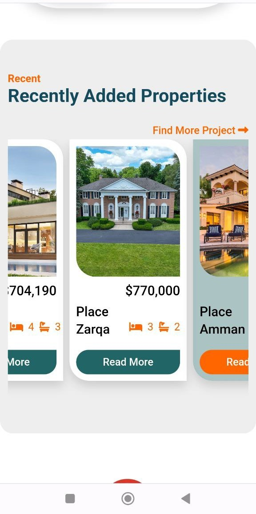
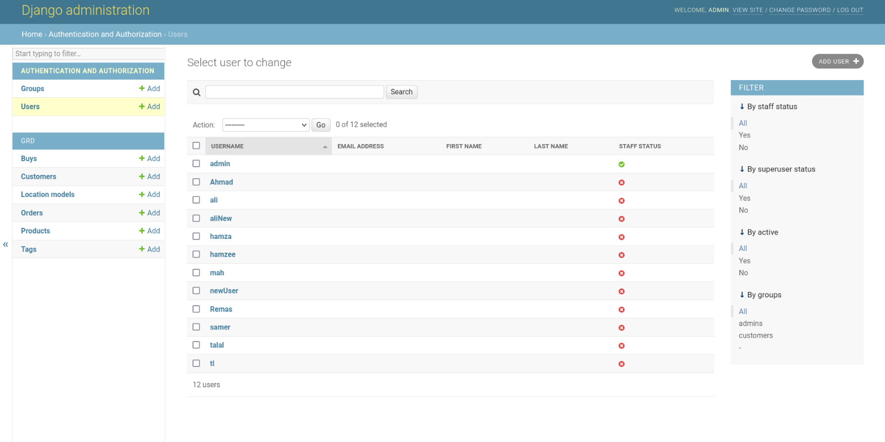

# SakanPlus-Real-Estate
The Sakan Plus project is an online platform for buying and selling real estate and homes. It provides an easy-to-use platform that allows users to search for properties based on their preferences as it offers a wide range of available properties and advanced search tools.

# SakanPlus Logo


## Table of Contents

- [Introduction](#introduction)
- [Usage](#usage)
- [Features](#features)
- [Demos](#demos)

- [The Website On Screen Phone](#the-website-on-screen-phone)
- [How It Work Platform](#how-it-work-platform)
- [Dashboard](#dashboard)
- [The Maps](#the-maps)


- [ChatBot Agent](#chatbot-agent)
- [Contributors](#contributors)
- [Articles and Guides that cover SakanPlus](#articles-and-guides-that-cover-sakanplus)
- [Feedback](#feedback)

- [Having Problems?](#having-problems)
- [Thanks](#thanks)
- [Project Conclusion](#project-conclusion)

## Introduction

<p>SakanPlus is an online platform that enables property buyers and sellers to connect and make transactions without leaving their homes. With an intuitive user interface and advanced search features, the website simplifies the buying and selling process for all parties involved.</p>

- For Sellers ,offers a convenient way to list their properties and connect with potential buyers. Sellers can easily manage their listings, respond to inquiries, and finalize transactions.

- For buyers ,the website provides access to a wide range of properties, with detailed information and high-quality photos to help them make informed decisions. Buyers can easily search for properties that meet their specific criteria, contact sellers, and make offers.

<p>Overall, our real estate website is designed to provide a seamless, secure, and efficient way for property buyers and sellers to connect and conduct transactions online.</p>

## Usage

- Registration

- search for properties

- View property details

- Contact the seller

- Buy or sell a property

- Payment and transactions

## Features
- Responsive design
  - SakanPlus platform is designed to be fully responsive, which means that it can adapt to different screen sizes and devices.
- Advanced search functionality
  - platform features advanced search functionality that allows users to filter properties based on a range of criteria.
- Property listings management
  - platform provides sellers with an easy way to manage their property listings.
- Secure user authentication
  - features secure user authentication and authorization.
- Payment gateway integration
  - all transactions are processed securely and efficiently.
- API integration
  - developers can build custom applications that can interact with the platform. 
  
## Demos
#### User-contributed shared SakanPlus notebook demo (not officially supported): Deepnote
```bash
@SakanPlus

git clone https://github.com/cerbos/demo-python.git 
cd demo-python
...
curl http://localhost:8080/deploy-folder/request-path?function=getPathInfo
```

## The Website On Screen Phone

Responsive design: SakanPlus is designed to be fully responsive, which means that it can adapt to different screen sizes and devices. This ensures that users can access the platform on their desktops, laptops, tablets, and smartphones, and have a consistent experience across all devices.
<div>





</div>

  
## How It Work Platform

## Dashboard




## The Maps
Map view: SakanPlus platform features a map view that displays all available properties on a map. Users can zoom in and out to view properties in different areas and get a sense of their location and surroundings.

- Microsoft provides a map API called Bing Maps API. You can access it through the Microsoft Azure portal.
```
<script type='text/javascript' src='http://www.bing.com/api/maps/mapcontrol?callback=loadMapScenario' async defer></script>

 <script type='text/javascript'>
      function loadMapScenario() {
        var map = new Microsoft.Maps.Map(document.getElementById('myMap'), {
          credentials: 'Your Bing Maps API Key'
        });
      }
    </script>
```


## ChatBot Agent

## Contributors
This project follows the all-contributors specification and is brought to you by these awesome contributors.
* [MALEK FRAIJ](https://github.com/MALEK-FRAIJ)
* [Aliah12u](https://github.com/Aliah12u)
* [Azak201](https://github.com/Azak201)

## Articles and Guides that cover SakanPlus

## Feedback
- Feel free to send us feedback on Facebook or file an issue. Feature requests are always welcome.
- If there's anything you'd like to chat about, please feel free .
- If you wish to contribute, please take a quick look at the guidelines.

## Having Problems?
  If you run into problems, please read the Common Errors section of the wiki before filing a github issue.
  
## Thanks

## Project Conclusion
  
  
